## Studied systems {.smaller}

<br/>

:::: {.columns style="display:flex; align-items:center; gap:0em;"}
::: {.column width="50%"}
::: {#fig-Photo_intro}
```{r}
#| echo: false
#| out.height: "400px"
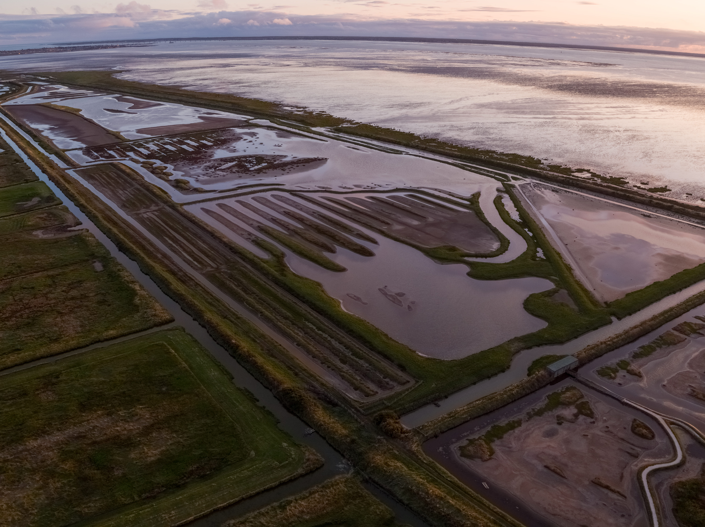
```

The Moëze-Oléron National Nature Reserve on the mainland side 
<span style="font-size:60%; color:gray;">(photo: Romain Beaubert, LPO)</span>
:::
:::

::: {.column width="50%"}
::: {#fig-Photo_intro}
```{r}
#| echo: false
#| out.height: "400px"
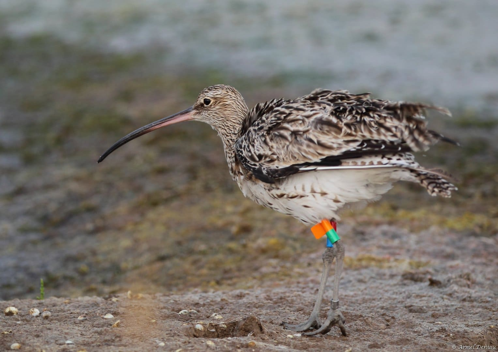
```

A colour ringed Eurasian Curlew (<em>Numenius arquata</em>) 
<span style="font-size:60%; color:gray;">(photo: Armel Deniau, LPO)</span>
:::
:::
::::

## Studied systems {.smaller}

<br/>

About 100.000 water bird individuals counted in the nature reserve and around in 2024

<br/>

::: {#fig-Photo_intro}
```{r}
#| echo: false
knitr::include_graphics("no legend 2.jpg", dpi = 100)
```

The functional site around the Moëze-Oléron National Nature Reserve
:::

## Objectives of the study {.smaller}

<br/>

:::: {.columns style="display:flex; align-items:center; gap:0em;"}
::: {.column width="50%"}

Understand how the Eurasian curlew uses space in a functional site comprising the Marennes basin and the Brouage marshes, in a context **sea level rise** and **coastal squeeze **, and strong **hunting** pressures. 

Identify local **priority areas** to be preserved for the protection of **wader birds**, as the Eurasian curlew as flagship species.
:::

::: {.column width="50%"}
::: {#fig-RNN_photo_3}
```{r}
#| echo: false
#| out.width: "600px"
knitr::include_graphics("3-Equipement GPS courlis cendré-Photo Loic Jomat - LPÖ.jpg", dpi = 300)
```

Equipping Curlew
<span style="font-size:60%; color:gray;">(photo: Loic Jomat)</span>
:::
:::
::::

## Studied systems {.smaller}

##### The Moëze-Oléron National Nature Reserve

::: {#fig-RNN_photo_1}
```{r}
#| echo: false
knitr::include_graphics("RNN_photo_1.png", dpi = 200)
```

The Moëze-Oléron National Nature Reserve on the mainland side
<span style="font-size:60%; color:gray;">(photo: Romain Beaubert, LPO)</span>

:::

## Studied systems {.smaller data-visibility="uncounted"}

##### The Moëze-Oléron National Nature Reserve

::: {#fig-RNN_photo_3}
```{r}
#| echo: false
knitr::include_graphics("RNN_photo_3.png", dpi = 200)
```

The Moëze-Oléron National Nature Reserve on the mainland side 
<span style="font-size:60%; color:gray;">(photo: Romain Beaubert, LPO)</span>

:::

## Studied systems {.smaller data-visibility="uncounted"}

##### The Moëze-Oléron National Nature Reserve

::: {#fig-RNN_photo_4}
```{r}
#| echo: false
knitr::include_graphics("RNN_photo_4.png", dpi = 200)
```

The Moëze-Oléron National Nature Reserve on the mainland side 
<span style="font-size:60%; color:gray;">(photo: Romain Beaubert, LPO)</span>

:::

## Studied data and location {.smaller}

80 individuals

36 females, 39 males, 7 unknown

20 juveniles, 60 adults

= 2,226,199 studied GPS points 

::: {#fig-zone_map}
```{r}
#| echo: false

library(htmltools)

tags$iframe(
  src = "zone_map_new.html",
  width = "100%",
  height = "350px"
)
```

Studied area split into three main zones A, B and C. The red pin is the fieldwork station.
:::

## Roosting and foraging areas {.smaller}

##### Methods

<br/>

The GPS recorded points are associated with a behaviors : foraging, roosting and other.

<br/>

:::: {.columns style="display:flex; gap:3em;"}

::: {.column width="50%"}

::: {#fig-Photo_intro}
```{r}
#| echo: false
#| out.width: "600px"
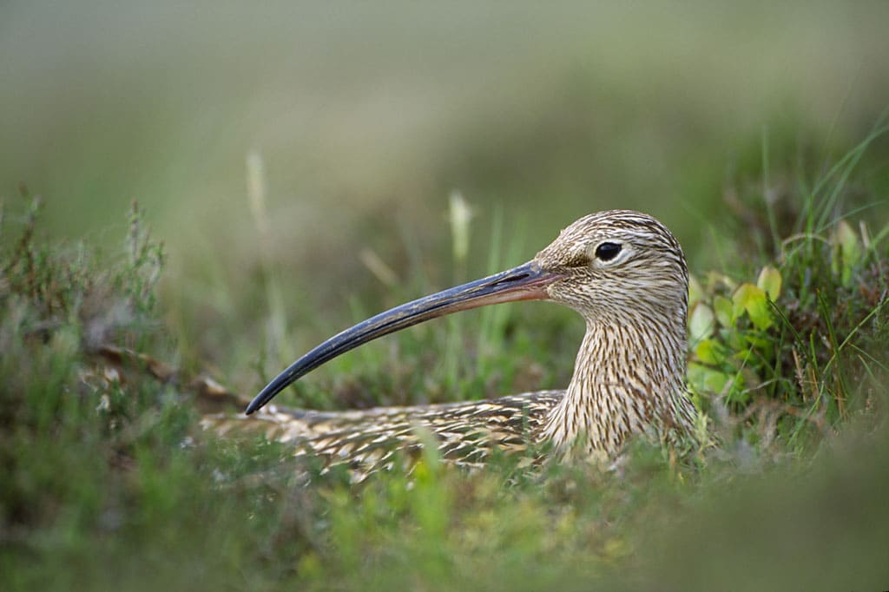
```

Roosting Curlew
<span style="font-size:60%; color:gray;">(photo: aurie Campbell)</span>

:::
::: 

::: {.column width="50%"}

::: {#fig-Photo_intro}
```{r}
#| echo: false
#| out.width: "600px"
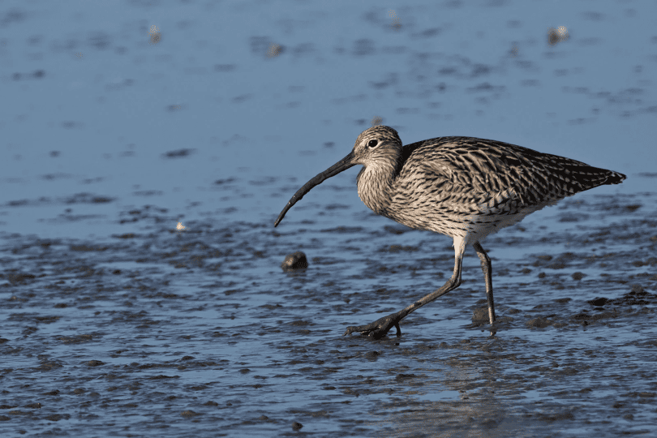
```

Foraging Curlew
<span style="font-size:60%; color:gray;">(photo: Pierre-Marie Epiney)</span>
:::

:::

::::

## Roosting and foraging areas {.smaller data-visibility="uncounted"}

##### Methods

<br/>

The GPS recorded points are associated with a behaviors : foraging, roosting and other.

<br/>

:::: {.columns style="display:flex; gap:3em;"}

::: {.column width="50%"}

Foraging:

1) movement filter (stationary, ≤ 1 km/h)

2) time filter (2h before/after a low tide)

::: 

::: {.column width="50%"}

::: {#fig-Photo_intro}
```{r}
#| echo: false
#| out.width: "600px"

```

Foraging Curlew
<span style="font-size:60%; color:gray;">(photo: Pierre-Marie Epiney)</span>
:::

:::

::::

## Roosting and foraging areas {.smaller}

##### Methods

<br/>

The GPS recorded points are associated with a behaviors : foraging, roosting and other.

<br/>

:::: {.columns style="display:flex; gap:3em;"}

::: {.column width="50%"}

::: {#fig-Photo_intro}
```{r}
#| echo: false
#| out.width: "600px"

```

Roosting Curlew
<span style="font-size:60%; color:gray;">(photo: aurie Campbell)</span>

::: 

::: 

::: {.column width="50%"}

Roosting:

1) movement filter (stationary, ≤ 1 km/h)

2) time filter (2h before/after a high tide)

3) bathymetry filter (above the lowest astronomical high tide threshold)

4) habitat filter (outside the intertidal zone)

:::
::::

## Roosting and foraging areas {.smaller}

##### Foraging - Results 

<div class="smaller">

Utilization distribution and **kernel** analyses (<span style="font-family:'Courier New', Courier, monospace;">kernelUD</span> R package 'adehabitatHR', Calenge 2006 and Worton, 1995) on randomly sampled up to 1000 GPS points per individual.

Main area: 50% vertices in dark orange; larger area: 95% vertices in light orange

</div>

:::: {.columns style="display:flex; align-items:center; gap:0em;"}
::: {.column width="33%"}
::: {#fig-UDMap_Foraging_A}
```{r}
#| echo: false

tags$iframe(
  src = "UDMap_make_kud_sampled_Foraging_A.html",
  width = "100%",
  height = "400px"
)
```
Zone A
:::
:::

::: {.column width="33%"}
::: {#fig-UDMap_Foraging_B}
```{r}
#| echo: false

tags$iframe(
  src = "UDMap_make_kud_sampled_Foraging_B.html",
  width = "100%",
  height = "400px"
)
```
Zone B
:::
:::

::: {.column width="33%"}
::: {#fig-UDMap_Foraging_C}
```{r}
#| echo: false

tags$iframe(
  src = "UDMap_make_kud_sampled_Foraging_C.html",
  width = "100%",
  height = "400px"
)
```
Zone C
:::
:::
::::

## Roosting and foraging areas {.smaller}

##### Roosting - Results 

<div class="smaller">

Utilization distribution and **kernel** analyses (<span style="font-family:'Courier New', Courier, monospace;">kernelUD</span> R package 'adehabitatHR', Calenge 2006 and Worton, 1995) on randomly sampled up to 1000 GPS points per individual.

Main area: 50% vertices in dark orange; larger area: 95% vertices in light orange

</div>
:::: {.columns style="display:flex; align-items:center; gap:0em;"}
::: {.column width="33%"}
::: {#fig-UDMap_roosting_A}
```{r}
#| echo: false

tags$iframe(
  src = "UDMap_make_kud_sampled_Roosting_A.html",
  width = "100%",
  height = "400px"
)
```
Zone A
:::
:::

::: {.column width="33%"}
::: {#fig-UDMap_roosting_B}
```{r}
#| echo: false

tags$iframe(
  src = "UDMap_make_kud_sampled_Roosting_B.html",
  width = "100%",
  height = "400px"
)
```
Zone B
:::
:::

::: {.column width="33%"}
::: {#fig-UDMap_roosting_C}
```{r}
#| echo: false

tags$iframe(
  src = "UDMap_make_kud_sampled_Roosting_C.html",
  width = "100%",
  height = "400px"
)
```
Zone C
:::
:::
::::

## Roosting and foraging areas {.smaller}

##### Roosting area during submersion extreme events - Results 

::: {#fig-UDMap_roosting_A}
```{r}
#| echo: false

tags$iframe(
  src = "UDMap_make_kud_sampled_hauteur_maree_Roosting_periode_sub_B (1).html",
  width = "100%",
  height = "500px"
)
```

Roosting area during submersion extreme events: no submersion (between j-15 to j-11 before a submersion) in purple, submersion in yellow. 

:::


## Roosting-foraging distance {.smaller}

##### Methods

The **mean distance** between the **foraging and roosting** areas of each individual 

= mean distance between pairs of **individual** geographic foraging and roosting **centroids** at **each tide** cycle.

::: {#fig-distance_roost_forag_allvar_plot}
```{r}
#| echo: false
#| out.width: 90%
#| fig-align: "center"
knitr::include_graphics("distance_schema_geoportail_0.png", dpi = 100)
```

Estimating mean distance between roosting and foraging areas for each individual.
:::

## Roosting-foraging distance {.smaller data-visibility="uncounted"}

##### Methods

The **mean distance** between the **foraging and roosting** areas of each individual 

= mean distance between pairs of **individual** geographic foraging and roosting **centroids** at **each tide** cycle.

::: {#fig-distance_roost_forag_allvar_plot}
```{r}
#| echo: false
#| out.width: 90%
#| fig-align: "center"
knitr::include_graphics("distance_schema_geoportail_1.png", dpi = 100)
```

Estimating mean distance between roosting and foraging areas for each individual.
:::

## Roosting-foraging distance {.smaller data-visibility="uncounted"}

##### Methods

The **mean distance** between the **foraging and roosting** areas of each individual 

= mean distance between pairs of **individual** geographic foraging and roosting **centroids** at **each tide** cycle.

::: {#fig-distance_roost_forag_allvar_plot}
```{r}
#| echo: false
#| out.width: 90%
#| fig-align: "center"
knitr::include_graphics("distance_schema_geoportail_2.png", dpi = 100)
```

Estimating mean distance between roosting and foraging areas for each individual.
:::

## Roosting-foraging distance {.smaller data-visibility="uncounted"}

##### Methods

The **mean distance** between the **foraging and roosting** areas of each individual 

= mean distance between pairs of **individual** geographic foraging and roosting **centroids** at **each tide** cycle.

::: {#fig-distance_roost_forag_allvar_plot}
```{r}
#| echo: false
#| out.width: 90%
#| fig-align: "center"
knitr::include_graphics("distance_schema_geoportail_3.png", dpi = 100)
```

Estimating mean distance between roosting and foraging areas for each individual.
:::

## Roosting-foraging distance {.smaller data-visibility="uncounted"}

##### Methods

The **mean distance** between the **foraging and roosting** areas of each individual 

= mean distance between pairs of **individual** geographic foraging and roosting **centroids** at **each tide** cycle.

::: {#fig-distance_roost_forag_allvar_plot}
```{r}
#| echo: false
#| out.width: 90%
#| fig-align: "center"
knitr::include_graphics("distance_schema_geoportail_4.png", dpi = 100)
```

Estimating mean distance between roosting and foraging areas for each individual.
:::

## Roosting-foraging distance {.smaller} 

##### Results

::: {#fig-distance_roost_forag_allvar_plot}
::: {.center .v-center}
```{r}
#| echo: false
#| out.width: 90%
knitr::include_graphics("distance_roost_forag_plot_talk.png", dpi = 100)
```
:::

Individual mean roosting-foraging distance (+/- standard error).
:::
  
## Roosting-foraging distance {.smaller}

##### Results

:::: {.columns style="display:flex; align-items:center; gap:3em;"}

::: {.column width="50%"}

::: {#fig-pred_all_plot.png}
```{r}
#| echo: false
#| out.width: 90%
#| fig-align: "center"
knitr::include_graphics("pred_all_plot.png", dpi = 100)
```

Individual mean roosting-foraging distance (+/- standard error) as a function of sex, age and the tide.
:::
::: 

::: {.column width="50%"}

Best model : 

**Dist ~ sex + age + tide + sex:age + sex:tide + age:tide**

<br/> 

<div style="text-align:center; font-size:0.7em">
| Effect                               | Est. | SE | p-val |
|--------------------------------------|-----:|---:|------:|
| **Intercept**                            |8.16  |0.13 |**<0.001**|
| Sex (M)                              |-0.09 |0.14  |0.549   |
| Age (juvenile)                       |-0.05 |0.30  |0.862   | 
| Tide (spring tide)                   | 0.03 |0.18  |0.877   |     
| **Sex (M) × Age (juvenile)**             | 1.08 |0.42  |**0.011**   | 
| Sex (M) × Tide (spring tide)         |-0.15 |0.20  |0.464   | 
| **Age (juvenile) × Tide (spring tide)**  |-0.85 |0.42  |**0.047**   | 

<span style="font-size:80%; color:gray;">GLM, link function: Gamma (log)</span>
</div>

::: 

::::

## Avoidance from shore hunting {.smaller}  

::: {#fig-Photo_intro}
```{r}
#| echo: false
knitr::include_graphics("Photo archives Marc Demeure - VDNPQR.jpg", dpi = 200)
```

Hunters on the public maritime land 
<span style="font-size:60%; color:gray;">(photo : Marc Demeure, VDNPQR)</span>

:::

## Avoidance from shore hunting {.smaller}  

##### Results

:::: {.columns style="display:flex; align-items:center; gap:0em;"}
::: {.column width="50%"}
::: {#fig-UDMap_roosting_A}
```{r}
#| echo: false

tags$iframe(
  src = "UDMap_make_kud_sampled_Foraging_in_out_saison_B.html",
  width = "100%",
  height = "450px"
)
```

Foraging area during (orange) and out (grey) the hunting season (winter) on the public maritime land.
:::
:::

::: {.column width="50%"}
::: {#fig-UDMap_roosting_A}
```{r}
#| echo: false

tags$iframe(
  src = "UDMap_make_kud_sampled_Roosting_in_out_saison_B.html",
  width = "100%",
  height = "450px"
)
```

Roosting area during (purple) and out (grey) the hunting season (winter) on the public maritime land.
:::
::: 
::::

## Avoidance from shore hunting {.smaller}  

##### Results

:::: {.columns style="display:flex; align-items:center; gap:3em;"}
::: {.column width="50%"}

::: {#fig-pred_all_chasse_plot.png}
```{r}
#| echo: false
#| out.width: 90%
#| fig-align: "center"
knitr::include_graphics("pred_all_chasse_plot.png", dpi = 100)
```

Individual mean roosting-foraging distance (+/- standard error) as a function of sex and hunting on the public maritime land.
:::
::: 

::: {.column width="50%"}

Best model : 

**Dist ~ sex + hunting season**

<br/> 

<div style="text-align:center; font-size:0.7em">
| Effect                               | Est. | SE | p-val |
|--------------------------------------|-----:|---:|------:|
| **Intercept**                            |8.323  |0.135 |**<0.001**|
| **Sex (M)**                              |-0.983 |0.165 |**<0.001**  |
| **Hunting (forbidden)**                   | 0.482 |0.131  |**0.001**   |     

<span style="font-size:80%; color:gray;">GLM, link function: Gamma (log)</span>
</div>

::: 

::::

## To sum up {.smaller} 

:::: {.columns style="display:flex; align-items:center; gap:1em;"}

::: {.column width="50%"}

<br/>

- **New** roosting **sites outside** the Nature Reserve during **submersion** extreme events

- **Restricted** population **surfaces** during the **hunting** season

- Individual distance between roosting and foraging seems to vary:
<div class="smaller">
  - **juvenile males go further away** to roost *vs* to feed
  - **male** stay **closer** to feed and roost when spring tide *vs* neap tide
  - according to hunting
</div>
  
:::

::: {.column width="50%"}

<br/>

::: {#fig-Brachvogel}
```{r}
#| echo: false
#| out.width: "600px"
knitr::include_graphics("Réserve Naturelle Baie de Saint-Brieuc.png", dpi = 200)
```

Curlew lifestyle! <span style="font-size:60%; color:gray;">(photo: Großer_Brachvogel)</span>
:::
:::
::::
  
## Key takeaways to better protect curlews... and other birds {.smaller}  

<br/>

**Strengthen** the curlew's **protection status**

**Limit** the effects of **hunting** by : 

1) **prohibit hunting** in Saint-Froult beach to the **North** of the nature reserve 
2) **prohibit hunting** when **submersion** extreme events
3) **dismantle hunting huts** near the reserve's boundaries where **roosting sites** have been detected

::: {#fig-pred_all_plot.png}
```{r}
#| echo: false
#| out.width: 90%
#| fig-align: "center"
knitr::include_graphics("Côté_de_beauté_banner.jpg", dpi = 100)
```

Plaisance Beach, Saint-Froult, France 
<span style="font-size:60%; color:gray;">(photo : KiwiNeko14)</span>

:::

## Some art! {.smaller}

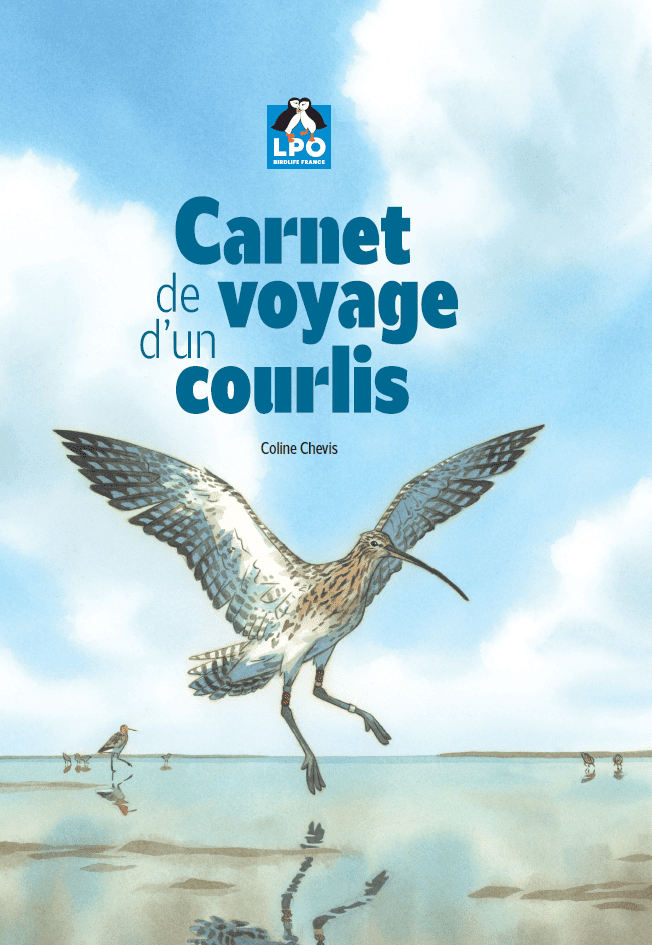{.absolute top=90 left=325 width="420" height="594"}

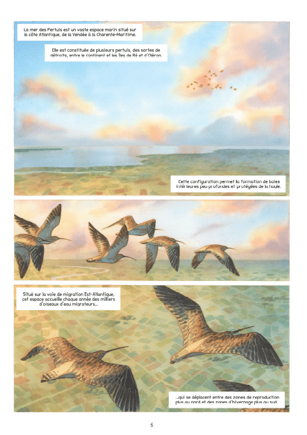{.absolute top=160 left=0 width="315" height="445.5"}

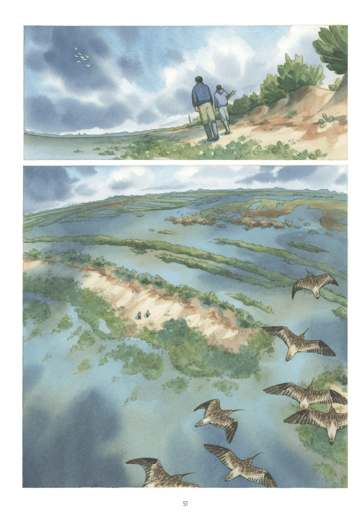{.absolute top=160 left=750 width="315" height="445.5"}

## Collaborators and fundings {.smaller} 

<br/>

:::: {.columns}

::: {.column width="50%"}

::: {.mytext style="line-height:0.7;"}
**Statistical and spatial analyses**

- Suzanne Bonamour [(LPO France)]{style="font-size:50%; color:gray;"}
- Gwenael Quaintenne [(LPO France)]{style="font-size:50%; color:gray;"}

**Fieldwork**

- Pierre Rousseau [(RNN Moëze-Oléron)]{style="font-size:50%; color:gray;"}
- Loïc Jomat [(RNN Moëze-Oléron)]{style="font-size:50%; color:gray;"}
- Adrien Chaigne [(RNN Moëze-Oléron)]{style="font-size:50%; color:gray;"}
- Pierrick Bocher [(Univ. La Rochelle)]{style="font-size:50%; color:gray;"}
- Frédéric Jiguet [(MNHN, CESCO, Paris)]{style="font-size:50%; color:gray;"}
- and many others!

:::
:::
::: {.column width="50%"}
::: {.mytext style="line-height:0.7;"}
**Fundraising** 

- Adrien Chaigne [(RNN Moëze-Oléron)]{style="font-size:50%; color:gray;"}

**Scientific counselling**

- Pierrick Bocher [(Univ. La Rochelle)]{style="font-size:50%; color:gray;"}
- Frédéric Jiguet [(MNHN, CESCO, Paris)]{style="font-size:50%; color:gray;"}
- Gwenael Quaintenne [(LPO France)]{style="font-size:50%; color:gray;"}

**Acknowledgements**

- Anais Dasnon [(LPO France)]{style="font-size:50%; color:gray;"}

:::
:::
::::

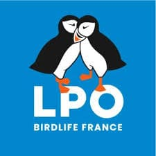{.absolute top=600 left=0 width="65" height="65"}

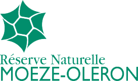{.absolute top=600 left=70 width="130" height="65"}

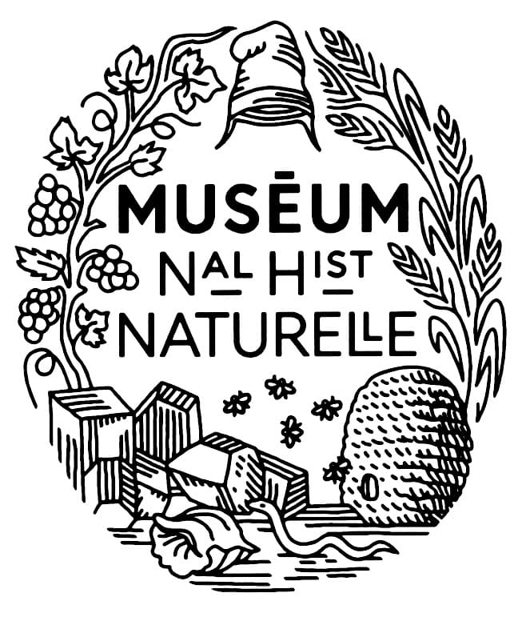{.absolute top=600 left=200 width="65" height="65"}

{.absolute top=600 left=270 width="210" height="65"}

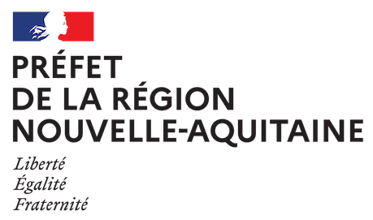{.absolute top=600 left=485 width="140" height="70"}

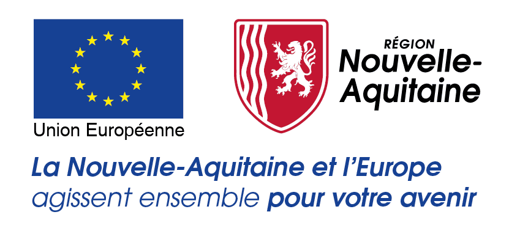{.absolute top=600 left=625 width="160" height="75"}

{.absolute top=600 left=785 width="80" height="75"}

{.absolute top=600 left=860 width="120" height="75"}


